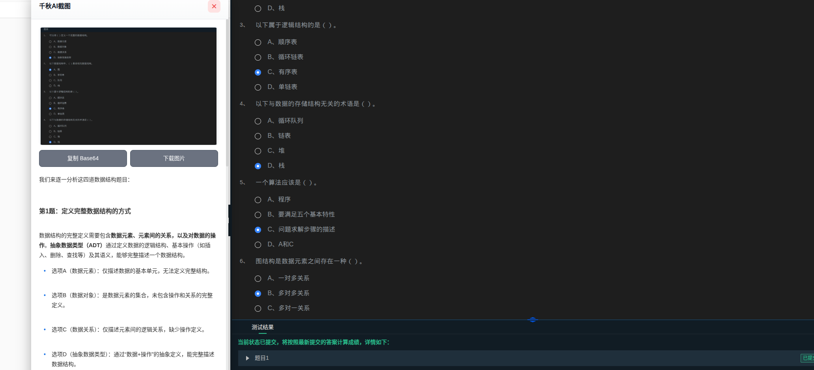
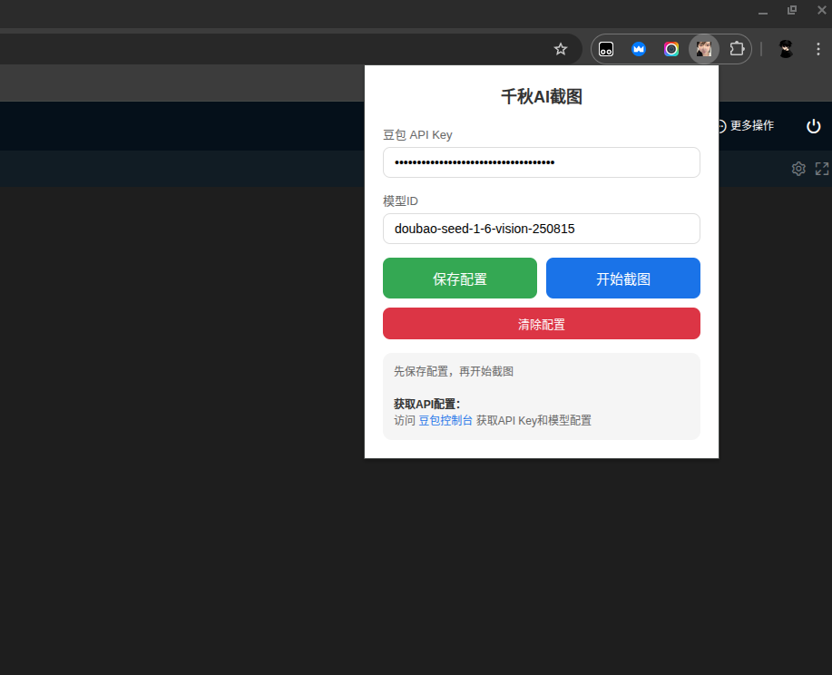
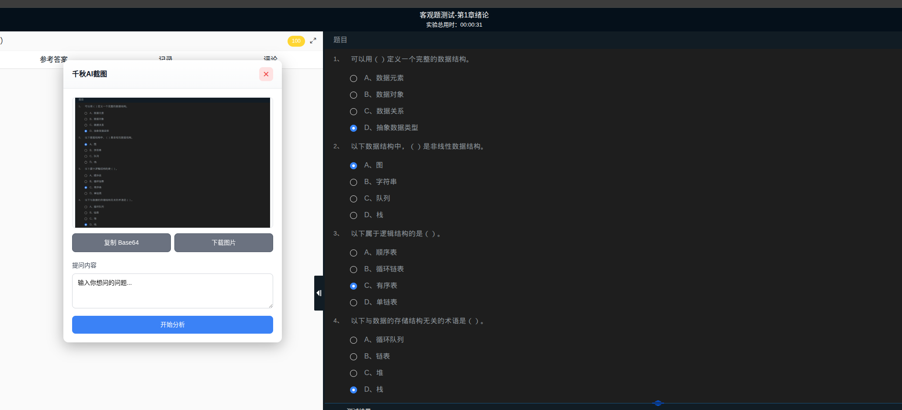

# 千秋AI截图

一个结合豆包API的浏览器插件，可以框选截图并进行AI智能分析。

## 效果展示

### 插件配置界面


### 截图分析界面


### AI分析结果


## 功能特点

- 🖼️ 框选截图：在任何网页上框选区域进行截图
- 🤖 AI分析：自动将截图发送给豆包AI进行智能分析
- 💬 对话框展示：以友好的对话框形式展示分析结果
- ⚙️ 简单配置：只需配置API Key和模型ID即可使用

## 从 GitHub/Gitee 安装使用

### 方法一：下载 ZIP 包

1. **下载源码**
   - GitHub: 点击页面右上角绿色的 `Code` 按钮，选择 `Download ZIP`
   - Gitee: 点击页面右上角的 `克隆/下载` 按钮，选择 `下载ZIP`

2. **解压文件**
   - 将下载的 ZIP 文件解压到本地文件夹
   - 记住解压后的 `screenshot-ai-extension` 文件夹路径

3. **加载到浏览器**
   - 打开 Chrome 浏览器，地址栏输入 `chrome://extensions/`
   - 开启右上角的"开发者模式"开关
   - 点击左上角"加载已解压的扩展程序"按钮
   - 选择刚才解压的 `screenshot-ai-extension` 文件夹
   - 扩展加载成功后会显示在列表中

### 方法二：使用 Git 克隆

```bash
# 从 GitHub 克隆
git clone https://github.com/你的用户名/你的仓库名.git

# 或从 Gitee 克隆
git clone https://gitee.com/你的用户名/你的仓库名.git

# 进入项目目录
cd 你的仓库名/screenshot-ai-extension
```

然后按照上面"加载到浏览器"的步骤操作。

## 配置步骤

1. **获取豆包API Key**
   - 访问火山引擎控制台：https://console.volcengine.com/ark
   - 注册/登录账号
   - 创建 API Key 和模型端点
   - 推荐使用模型：`doubao-seed-1-6-vision-250815`

2. **配置插件**
   - 点击浏览器工具栏的插件图标
   - 输入你的豆包 API Key
   - 输入模型ID（默认：doubao-seed-1-6-vision-250815）
   - 点击"保存配置"按钮
   - 看到"配置保存成功"提示即可

## 使用方法

1. 点击插件图标，点击"开始截图"按钮
2. 在网页上拖动鼠标框选要截图的区域
3. 松开鼠标后会弹出对话框显示截图
4. 在输入框中输入你想问的问题（或使用默认问题）
5. 点击"开始分析"按钮
6. 等待几秒后会显示AI分析结果
7. 可以点击"再问一次"重新提问
8. 按 ESC 键可以取消截图

## 功能说明

- **复制 Base64**：复制截图的 Base64 编码
- **下载图片**：将截图保存为 JPG 文件
- **再问一次**：对同一张图片提出新的问题
- **拖动窗口**：可以拖动对话框标题栏移动位置
- **Markdown 格式**：AI 回复支持 Markdown 格式，代码块可一键复制

## 图标说明

插件需要图标文件，请准备以下尺寸的图标：
- `icons/icon16.png` (16x16)
- `icons/icon48.png` (48x48)
- `icons/icon128.png` (128x128)

你可以使用任何图标，或者使用在线工具生成。

## 技术栈

- Manifest V3
- Chrome Extension API
- 豆包 API (火山引擎)
- Canvas API (图片处理)

## 注意事项

- 需要有效的豆包API Key才能使用
- 确保模型支持图片分析功能（推荐使用 vision 模型）
- 截图区域不能太小（至少10x10像素）
- API调用可能产生费用，请注意使用量
- 首次使用需要先保存配置再开始截图

## 故障排除

如果遇到问题：

1. **截图没反应**
   - 确保已点击"保存配置"
   - 刷新网页后重试
   - 检查浏览器控制台是否有错误

2. **API 调用失败**
   - 检查 API Key 是否正确
   - 检查模型 ID 是否有效
   - 确保网络连接正常
   - 查看控制台错误信息

3. **图片无法显示**
   - 刷新扩展：在 `chrome://extensions/` 点击刷新按钮
   - 重新加载网页
   - 清除浏览器缓存

## 更新扩展

如果从 GitHub/Gitee 拉取了新版本：

```bash
# 进入项目目录
cd 你的仓库名

# 拉取最新代码
git pull

# 然后在 chrome://extensions/ 页面点击扩展的刷新按钮
```

## 开源协议

MIT License

## 贡献

欢迎提交 Issue 和 Pull Request！
